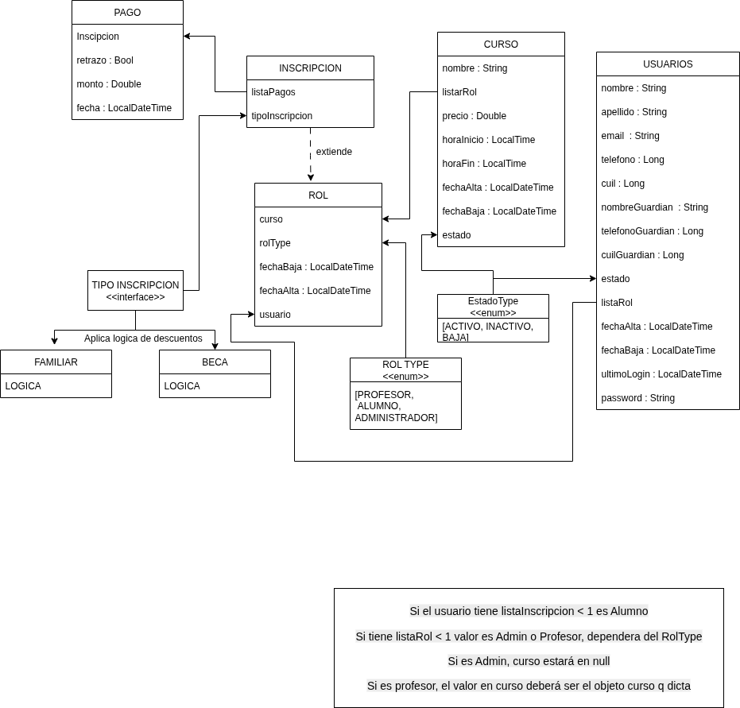

# Centro - Student Information System Backend

## Overview

Backend REST API for Centro SIS built with Spring Boot, Kotlin, Gradle, Spring Security with JWT, Spring Data JPA, and PostgreSQL.

## 🗺️ Modelo de Entidad-Relación

## Prerequisites

- Java 17+
- PostgreSQL database
- Gradle
